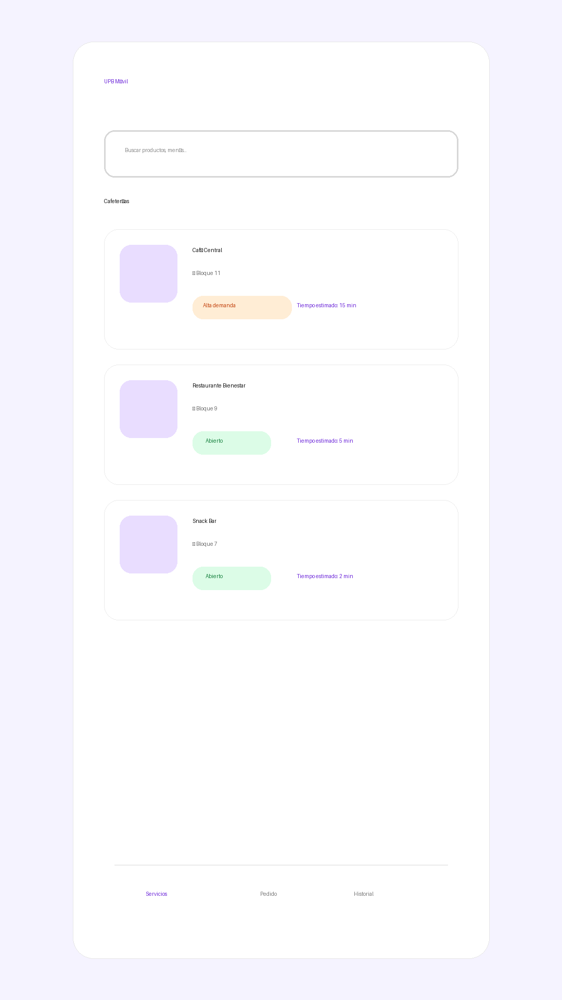

# UPB Móvil

Prototipo Android nativo en Kotlin + Jetpack Compose enfocado en la pantalla principal de cafeterías de la Universidad Pontificia Bolivariana.

## Objetivo del prototipo

Demostrar una experiencia móvil moderna para visualizar cafeterías, estado de demanda y tiempos estimados de espera, reduciendo fricción en horarios de alta congestión.

## Tecnologías usadas

- Kotlin
- Jetpack Compose
- Material 3
- Min SDK 24
- Target SDK 35
- Gradle Kotlin DSL
- GitHub Actions (CI/CD)

## Cómo ejecutar el proyecto

1. Abrir el proyecto en Android Studio (versión reciente compatible con AGP 8+).
2. Sincronizar Gradle.
3. Ejecutar en emulador o dispositivo:
   ```bash
   ./gradlew assembleDebug
   ```
4. APK generado en:
   `app/build/outputs/apk/debug/app-debug.apk`

## CI/CD con GitHub Actions

Workflow: `.github/workflows/android.yml`

En cada `push` y `pull_request`:

1. Configura Java 17.
2. Da permisos de ejecución a `gradlew`.
3. Compila el APK debug con `./gradlew assembleDebug`.
4. Publica el APK como artifact.
5. Crea/actualiza un Release y adjunta el APK.

## Capturas esperadas

Pantalla principal con:

- Título **UPB Móvil**
- Barra de búsqueda: "Buscar productos, menús..."
- Sección **Cafeterías**
- Tarjetas de cafeterías con estado y tiempo estimado
- Bottom Navigation con **Servicios** seleccionado

Vista de referencia del prototipo implementado:



## Estructura del proyecto

```text
app/src/main/java/com/upbmovil/
├── MainActivity.kt
├── components/
│   ├── BottomBar.kt
│   └── CafeteriaCard.kt
├── models/
│   └── Cafeteria.kt
├── screens/
│   └── HomeScreen.kt
└── ui/theme/
    ├── Color.kt
    ├── Theme.kt
    └── Type.kt
```
